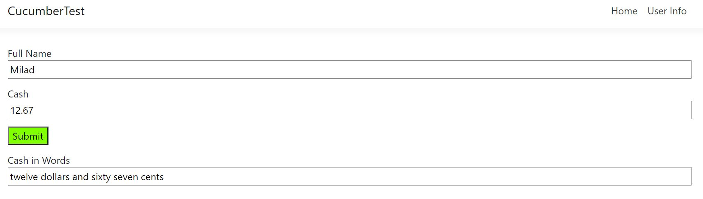

# ASP.NET Core & Angular

This template is a simple startup project to start with ASP.NET Core and Angular 8.

## Prerequirements

* Visual Studio 2019
* Visual Studio Code
* .NET Core SDK
* Node

## How To Run

* Open solution in Visual Studio 2019
* Set .Web project as Startup Project and build the project.
* Run the application.

## Areas To Improve

* Angular form validation
* Using Angular Materials library
* Exception filter to remove the try catch block out of controller
* Global exception handler to remove hard coded exceptions in different places